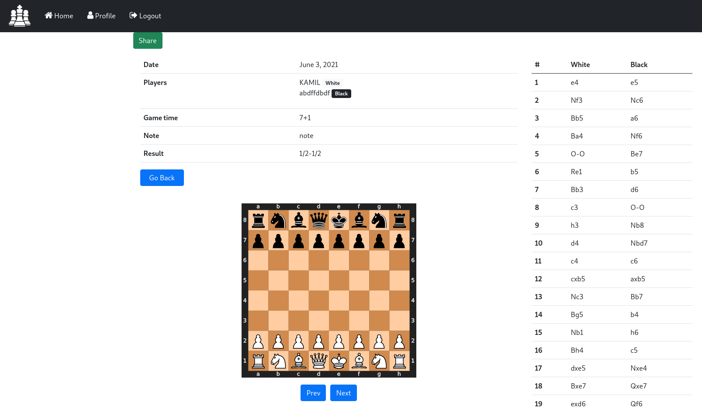

# Chess Archive
## Autorzy
- Damian Cyper
- Kamil Polak
## Opis
Projekt jest aplikacją webową, która obsługuje bazę danych dla archiwum partii szachowych. Będzie zawierała takie informacje jak: nicki obu grających stron, kolor którą grała każda ze stron, tempo gry, wszystkie posunięcia w partii, ranking obu graczy, datę rozegrania partii. Dodatkowo do każdej z partii możliwe będzie dodanie własnej notatki (uwag na temat gry). Dane zgromadzone w bazie będzie można przeszukiwać wpisując nick jednego z graczy lub wykorzystując dostępne filtry wyszukiwania: określony przedział czasu, przedział rankingu obu graczy, wpisanie konkretnego tempa gry lub podanie pierwszego ruchu. Oprócz tego będzie możliwość sortowania zgromadzonych danych m.in po dacie, rankingu. Projekt zakłada możliwość utworzenia konta przez użytkownika. Każdy użytkownik może założyć swoje prywatne archiwum, do którego inni użytkownicy nie mają dostępu.
## Technologie
- PostgreSQL - system bazy danych
- Django - web framework
- Django ORM - system mapowania obiektowo-relacyjnego

## Instrukcja uruchomienia w Dockerze

1. Pobrać repozytorium na dysk
```shell
git clone https://github.com/Kamil153/chessarchive.git && cd chessarchive
```
2. Stworzyć w głównym katalogu plik .env z danymi potrzebnymi do połączenia z bazą danych według poniższego wzoru. Na [ElephantSQL](https://www.elephantsql.com/) można za darmo założyć baze danych PostgreSQL.
```shell
touch .env
```
```
DB_NAME=nazwabazy
DB_USER=uzytkownik
DB_PASSWORD=haslo
DB_HOST=example.com
DB_PORT=5432
```
3. Zbudować obraz
```shell
docker build --tag chessarchive .
```
4. Zastosować do bazy danych migracje
```shell
docker run --env-file ./.env -p 8000:8000 chessarchive python manage.py migrate
```
5. Uruchomić serwer
```shell
docker run --env-file ./.env -p 8000:8000 chessarchive
```

## Schemat bazy danych


## Opis tabel

1. `auth_user` - tabela wszystkich użytkowników korzystających z aplikacji webowej
2. `archive_gametime` - tabela wszystkich możliwych temp gry. Jeżeli podanego przez użytkownika tempa gry w danej partii nie ma w tabeli to jest ona dodawana automatycznie do bazy.
3. `archive_chessgame` - tabela wszystkich partii w systemie. Zbiera partie wszystkich użytkowników w jedną tabelę.
4. `archive_playerdetails` - tabela zbierająca informacje na temat gracza aktualne w danej partii.
5. `archive_movement` - tabela informująca o ruchach w partii.
6. `archive_chessplayer` - tabela zbierająca informacje o wprowadzonych graczach partii.
7. `archive_profile_friends` - tabela zawierająca informacje o znajomościach pomiędzy użytkownikami (relacja wiele-do-wielu).
8. `archive_profile_invitations` - tabela gromadząca wszystkie oczekujące zaproszenia do dołączenia do grona znajomych (oczekują tam wszystkie zaproszenia które nie zostały ani zaakceptowane ani odrzucone)
9. `archive_profile` - tabela będąca rozszerzeniem tabeli auth_user

## Struktura plików

```
chessarchive
├── chessarchive
│   └── ...
├── archive
│   ├── templates
│   │   └── ...
│   ├── static
│   │   └── ...
│   ├── migrations
│   │   └── ...
│   ├── admin.py
│   ├── models.py
│   ├── urls.py
│   ├── views.py
│   └── ...
├── templates
└── manage.py
```

- `chessarchive` - katalog zawierający podstawową konfigurację aplikacji
- `templates` - katalog zawierający globalne szablony dokumentów html (layout strony, metadane, nawigacja itp.)
- `archive/templates` - katalog zawierający szablony związane z archiwum
- `archive/static` - katalog zawierający pliki statyczne do wykorzystania przez przeglądarkę
- `archive/migrations` - katalog zawierający migracje wykorzystywane do aktualizacji struktury bazy danych w przypadku zmiany modelu.
- `archive/admin.py` - zawiera informacje o modelach które mają zostać wyświetlane w panelu administratora oraz w jaki sposób.
- `archive/models.py` - plik zawierający definicje modeli, które później są mapowane do tabel w bazie danych.
- `archive/urls.py` - zawarta jest tutaj informacja, które widoki mają zostać wyświetlone na określonym URL.
- `archive/views.py` - definicje widoków

## Widoki

Widoki znajdują się w pliku `archive/models.py`.
- `SignUpView` - obsługa rejestracji
- `EditProfileView` - edycja profilu użytkownika
- `GameList` - wyświetla listę gier użytkownika. Sprawdza, czy w URL znajduje się informacja o właścicielu. Jeśli tak, to wyświetla archiwum właściciela, pod warunkiem, że jest znajomym użytkownika wyświetlającego listę. Widok pozwala na sortowanie oraz filtrowanie według różnych kryteriów. Wykorzystuje do tego dane przekazane w parametrach GET:
    - `player_name` - filtrowanie według nazwy gracza
    - `date_from` - minimalna data rozegrania partii
    - `date_to` - maksymalna data rozegrania partii
    - `ranking_from` - minimalny ranking
    - `ranking_to` - maksymalny ranking
    - `game_time` - czas gry
    - `first_move` - pierwszy ruch w partii
    - `sort_by` - kryterium sortowania (`note`, `game_date` lub `game_time`)
    - `order` - kierunek sortowania (`desc` lub `asc`)
- `AddGameView` - jeśli zapytanie zostało wysłane metodą GET, to wyświetla formularz, natomiast jeśli została wykorzystana metoda POST, to na podstawie argumentów POST dodaje nową partię do archiwum użytkownika.
- `GameDetailView` - wyświetla szczegóły dotyczące partii. Jeśli partia nie została dodana przez użytkownika, to sprawdzane są jego uprawnienia do wyświetlania tej partii. Widok wyświetla m.in. posortowane ruchy, szachownica w formacie svg, oraz podstawowe informacje.
- `GameDeleteView` - jeśli metodą zapytania jest GET, to wyświetla potwierdzenie usunięcia partii, natomiast w przypadku metody POST, partia jest usuwana, o ile użytkownik jest właścicielem tej partii.
- `FriendList` - widok wykorzystywany na stronie głównej, wyświetla listę znajomych użytkownika oraz listę wszystkich użytkowników.
- `send_invitation` - widok wysyłający zaproszenie do użytkownika, którego nazwa została przekazana jako parametr URL.
- `accept_invitation` - odrzuca zaproszenie od użytkownika o nazwie podanej przez parametr URL.
- `reject_invitation` - podobny do `accept_invitation, odrzuca zaproszenie.
- `share` - pobiera id partii z parametrów URL oraz udostępnia tę partię znajomym. Tylko właściciel partii może ją udostępnić.
- `unshare` - anuluje udostępnianie partii


## Interfejs aplikacji

1. Użytkownik niezalogowany ma jedynie możliwość zalogowania się lub założenia konta. Pokazany widok można znaleźć w kodzie tutaj:
https://github.com/Kamil153/chessarchive/blob/0fc1606e74d173583c63559b3cf16d01bc774cca/archive/templates/home.html#L21

   

2. Użytkownik może zalogować się. Ta funkcjonalność (oraz pozostałe funkcjonalności dotyczące rejestracji, resetowania hasła) została zaimplementowana tutaj: https://github.com/Kamil153/chessarchive/tree/master/templates/registration

   

3. Może również założyć nowe konto

   

4. Ma również możliwość resetowania hasła

   

5. Po zalogowaniu użytkownik widzi stronę domową (administrator ma dodatkowe pole "Settings", którego nie widzi każdy inny użytkownik bez uprawnień).
   Widok html implementujacy stronę domową można znaleźć tutaj: https://github.com/Kamil153/chessarchive/blob/master/archive/templates/home.html
   Obsługa tego i innych widoków została zaimplementowana w pliku views.py (https://github.com/Kamil153/chessarchive/blob/master/archive/views.py)
   


6. Użytkownik może edytować informacje takie jak adres email oraz nazwa użytkownika. Może również zmienić hasło (zostanie przeniesiony na widok nr 4)
   


7. Każdy zalogowany użytkownik ma opcję dodania nowej partii do swojej bazy
   


8. Może również zobaczyć całe swoje archiwum
   


9. Ma też dostęp do dokładniejszych informacji każdej z partii
   
