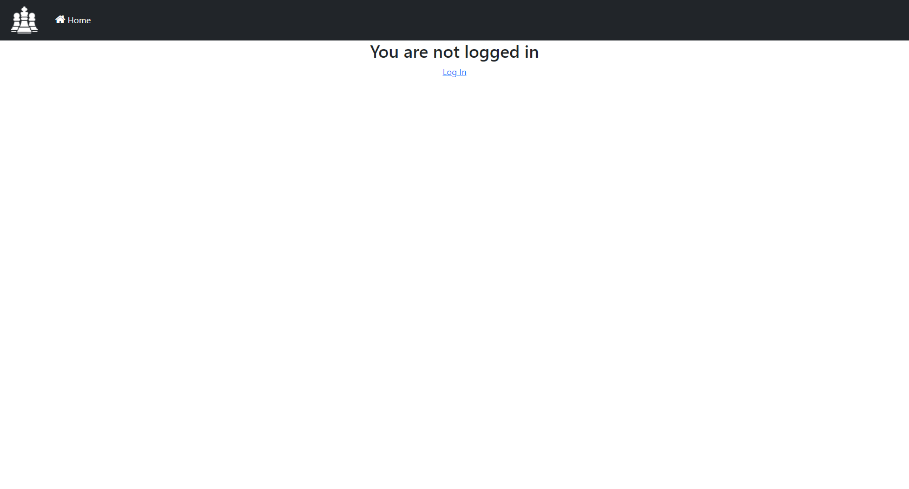

# Chess Archive
## Autorzy
- Damian Cyper
- Kamil Polak
## Opis
Projekt jest aplikacją webową, która obsługuje bazę danych dla archiwum partii szachowych. Będzie zawierała takie informacje jak: nicki obu grających stron, kolor którą grała każda ze stron, tempo gry, wszystkie posunięcia w partii, ranking obu graczy, datę rozegrania partii. Dodatkowo do każdej z partii możliwe będzie dodanie własnej notatki (uwag na temat gry). Dane zgromadzone w bazie będzie można przeszukiwać wpisując nick jednego z graczy lub wykorzystując dostępne filtry wyszukiwania: określony przedział czasu, przedział rankingu obu graczy, wpisanie konkretnego tempa gry lub podanie pierwszego ruchu. Oprócz tego będzie możliwość sortowania zgromadzonych danych m.in po dacie, rankingu. Projekt zakłada możliwość utworzenia konta przez użytkownika. Każdy użytkownik może założyć swoje prywatne archiwum, do którego inni użytkownicy nie mają dostępu.
## Technologie
- PostgreSQL - system bazy danych
- Django - web framework
- Django ORM - system mapowania obiektowo-relacyjnego

## Schemat bazy danych

## Opis tabel

1. Użytkownicy_aplikacji - tabela wszystkich użytkowników korzystających z aplikacji webowej
2. Tempa_gry - tabela wszystkich możliwych temp gry. Jeżeli podanego przez użytkownika tempa gry w danej partii nie ma w tabeli to jest ona dodawana automatycznie do bazy.
3. Partie - tabela wszystkich partii w systemie. Zbiera partie wszystkich użytkowników w jedną tabelę.
4. Szczegóły_gracza - tabela zbierająca informacje na temat gracza aktualne w danej partii.
5. Ruchy - tabela informująca o ruchach w partii.
6. Gracze - tabela zbierająca informacje o wprowadzonych graczach partii. Tabela zbiera w jedną tabelę wszystkich graczy wprowadzonych przez wszystkich użytkowników systemu

## Przegląd aplikacji

1. Użytkownik niezalogowany ma jedynie możliwość zalogowania się lub założenia konta

   

2. Użytkownik może zalogować się...

   

3. ...lub założyć nowe konto

   

4. Ma również możliwość resetowania hasła

   

5. Po zalogowaniu użytkownik widzi stronę domową (administrator ma dodatkowe pole "Settings", którego nie widzi każdy inny użytkownik bez uprawnień)

   

6. Użytkownik może edytować informacje takie jak adres email oraz nazwa użytkownika. Może również zmienić hasło (zostanie przeniesiony na widok nr 4)

   

7. Każdy zalogowany użytkownik ma opcję dodania nowej partii do swojej bazy

   

8. Może również zobaczyć całe swoje archiwum

   

9. Ma też dostęp do dokładniejszych informacji każdej z partii

   

