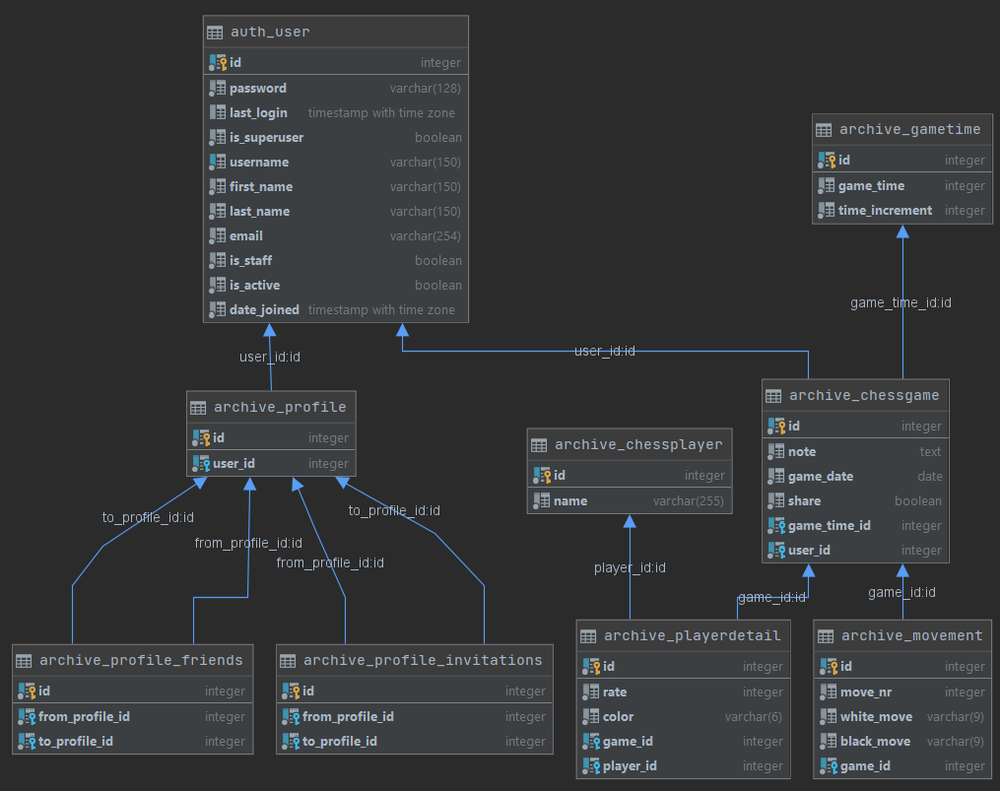

# Chess Archive
## Autorzy
- Damian Cyper
- Kamil Polak
## Opis
Projekt jest aplikacją webową, która obsługuje bazę danych dla archiwum partii szachowych. Będzie zawierała takie informacje jak: nicki obu grających stron, kolor którą grała każda ze stron, tempo gry, wszystkie posunięcia w partii, ranking obu graczy, datę rozegrania partii. Dodatkowo do każdej z partii możliwe będzie dodanie własnej notatki (uwag na temat gry). Dane zgromadzone w bazie będzie można przeszukiwać wpisując nick jednego z graczy lub wykorzystując dostępne filtry wyszukiwania: określony przedział czasu, przedział rankingu obu graczy, wpisanie konkretnego tempa gry lub podanie pierwszego ruchu. Oprócz tego będzie możliwość sortowania zgromadzonych danych m.in po dacie, rankingu. Projekt zakłada możliwość utworzenia konta przez użytkownika. Każdy użytkownik może założyć swoje prywatne archiwum, do którego inni użytkownicy nie mają dostępu.
## Technologie
- PostgreSQL - system bazy danych
- Django - web framework
- Django ORM - system mapowania obiektowo-relacyjnego

## Instrukcja uruchomienia w Dockerze

1. Pobrać repozytorium na dysk
```shell
git clone https://github.com/Kamil153/chessarchive.git && cd chessarchive
```
2. Stworzyć w głównym katalogu plik .env z danymi potrzebnymi do połączenia z bazą danych według poniższego wzoru. Na [ElephantSQL](https://www.elephantsql.com/) można za darmo założyć baze danych PostgreSQL.
```shell
touch .env
```
```
DB_NAME=nazwabazy
DB_USER=uzytkownik
DB_PASSWORD=haslo
DB_HOST=example.com
DB_PORT=5432
```
3. Zbudować obraz
```shell
docker build --tag chessarchive .
```
4. Zastosować do bazy danych migracje
```shell
docker run --env-file ./.env -p 8000:8000 chessarchive python manage.py migrate
```
5. Uruchomić serwer
```shell
docker run --env-file ./.env -p 8000:8000 chessarchive
```

## Schemat bazy danych



## Opis tabel

1. auth_user - tabela wszystkich użytkowników korzystających z aplikacji webowej
2. archive_gametime - tabela wszystkich możliwych temp gry. Jeżeli podanego przez użytkownika tempa gry w danej partii nie ma w tabeli to jest ona dodawana automatycznie do bazy.
3. archive_chessgame - tabela wszystkich partii w systemie. Zbiera partie wszystkich użytkowników w jedną tabelę.
4. archive_playerdetails - tabela zbierająca informacje na temat gracza aktualne w danej partii.
5. archive_movement - tabela informująca o ruchach w partii.
6. archive_chessplayer - tabela zbierająca informacje o wprowadzonych graczach partii. Tabela zbiera w jedną tabelę wszystkich graczy wprowadzonych przez wszystkich użytkowników systemu
7. archive_profile_friends - tabela zawierająca informacje na temat listy znajomych każdego użytkownika
8. archive_profile_invitations - tabela gromadząca wszystkie oczekujące zaproszenie do dołączenia do grona znajomych (oczekują tam wszystkie zaproszenia które nie zostały ani zaakceptowane ani odrzucone)
9. archive_profile - tabela będąca rozszerzeniem tabeli auth_user o listę znajomych i zaproszeń

## Obsługa bazy danych
Dodawanie nowej partii do bazy danych (za dodawanie odpowiada metoda post):

```python
class AddGameView(LoginRequiredMixin, View):
    def get(self, request):
        return render(request, "add_game.html")

    def post(self, request):
        white_player = request.POST["whitePlayer"]
        black_player = request.POST["blackPlayer"]
        white_rank = request.POST["whiteRank"]
        black_rank = request.POST["blackRank"]
        time = request.POST["time"]
        increment = request.POST["increment"]
        date = request.POST["date"]
        moves = request.POST["moves"]
        note = request.POST["note"]
        user = request.user

        if not GameTime.objects.filter(game_time=time, time_increment=increment).exists():
            game_time = GameTime(game_time=time, time_increment=increment)
            game_time.save()
        else:
            game_time = GameTime.objects.get(game_time=time, time_increment=increment)

        game = ChessGame(user=user, game_time=game_time, note=note, game_date=date)
        game.save()

        if not ChessPlayer.objects.filter(name=white_player).exists():
            player1 = ChessPlayer(name=white_player)
            player1.save()
        else:
            player1 = ChessPlayer.objects.get(name=white_player)

        if not ChessPlayer.objects.filter(name=black_player).exists():
            player2 = ChessPlayer(name=black_player)
            player2.save()
        else:
            player2 = ChessPlayer.objects.get(name=black_player)

        detail1 = PlayerDetail(rate=white_rank, color="white", player=player1, game=game)
        detail1.save()
        detail2 = PlayerDetail(rate=black_rank, color="black", player=player2, game=game)
        detail2.save()
```


Filtrowanie listy partii szachowych:

```python
class GameList(LoginRequiredMixin, generic.ListView):
    model = ChessGame

    def get_queryset(self):
        player_name = self.request.GET.get('player_name', None)
        date_from = self.request.GET.get('date_from', None)
        date_to = self.request.GET.get('date_to', None)
        ranking_from = self.request.GET.get('ranking_from', None)
        ranking_to = self.request.GET.get('ranking_to', None)
        game_time = self.request.GET.get('game_time', None)
        first_move = self.request.GET.get('first_move', None)
        selected_option = self.request.GET.get('sort_by', None)
        order = self.request.GET.get('order', None)
        username = self.kwargs.get('username', None)
        games = super().get_queryset()
        if username is not None:
            owner = User.objects.get(username=username)
            if owner is None:
                raise Http404()
            games = games.filter(user=owner, share=True)
        else:
            games = games.filter(user=self.request.user)

        if player_name:
            games = games.filter(playerdetail__player__name=player_name)
        if date_from:
            games = games.filter(game_date__gte=date_from)
        if date_to:
            games = games.filter(game_date__lte=date_to)
        if ranking_from:
            games = games.filter(playerdetail__rate__gte=ranking_from)
        if ranking_to:
            games = games.filter(playerdetail__rate__lte=ranking_to)
        if game_time:
            games = games.filter(game_time__game_time=game_time)
        if first_move:
            games = games.filter(movement__move_nr=1, movement__white_move=first_move)
```


Sortowanie listy partii szachowych:

```python
        if selected_option and selected_option in ['note', 'game_date', 'game_time']:
            order_str = selected_option
            if selected_option == 'game_time':
                order_str += '__game_time'
            if order and order == 'desc':
                order_str = '-' + order_str
            games = games.order_by(order_str)
```


Filtrowanie listy znajomych podczas wyszukiwania znajomego, do którego chcemy wysłać zaproszenie:

```python
    def get_queryset(self):
        username = self.request.GET.get('username', None)
        users = super().get_queryset().exclude(user=self.request.user)

        if username:
            users = users.filter(user__username=username)

        return users
```


Wysyłanie zaproszeń (dodawanie zaproszenia do bazy do tabeli archive_profile_invitations):

```python
@login_required
def send_invitation(request, username):
    user_from = request.user.profile
    user_to = User.objects.get(username=username).profile

    if user_to is not None and user_from != user_to \
            and user_to not in user_from.friends.all() \
            and user_to not in user_from.invitations.all() \
            and user_from not in user_to.invitations.all():
        user_from.invitations.add(user_to) #dodanie do bazy

    return redirect('home')
```


Akceptacja zaproszeń (usuwanie zaproszenia z bazy i dodawanie użytkownika do tabeli archive_profile_friends):

```python
@login_required
def accept_invitation(request, username):
    user_from = request.user.profile
    user_to = User.objects.get(username=username).profile

    if user_to is not None and user_from != user_to and user_to in user_from.invitations_received.all():
        user_from.friends.add(user_to)
        user_to.invitations.remove(user_from)

    return redirect('home')
```


Odrzucenie zaproszenia (usuwanie zaproszenia z bazy):

```python
@login_required
def reject_invitation(request, username):
    user_from = request.user.profile
    user_to = User.objects.get(username=username).profile

    if user_to is not None and user_from != user_to and user_to in user_from.invitations_received.all():
        user_to.invitations.remove(user_from)

    return redirect('home')
```


Udostępnianie partii znajomym (aktualizacja pola share w tabeli archive_chessgame):

```python
@login_required
def share(request, pk):
    game = ChessGame.objects.get(pk=pk)
    if game.user != request.user:
        return redirect('home')
    game.share = True
    game.save()
    return redirect('details', pk)
```


Cofanie udostępnienia partii (aktualizacja pola share w tabeli archive_chessgame). 

```python
@login_required
def unshare(request, pk):
    game = ChessGame.objects.get(pk=pk)
    if game.user != request.user:
        redirect('home')
    game.share = False
    game.save()
    return redirect('details', pk)

```


Usuwanie partii z bazy. W tym przypadku skorzystaliśmy z generic.DeleteView:

```python
class GameDeleteView(LoginRequiredMixin, generic.DeleteView):
    model = ChessGame
    success_url = reverse_lazy('game-list')
```


## Przegląd widoków aplikacji

1. Użytkownik niezalogowany ma jedynie możliwość zalogowania się lub założenia konta. Pokazany widok można znaleźć w kodzie tutaj:
https://github.com/Kamil153/chessarchive/blob/0fc1606e74d173583c63559b3cf16d01bc774cca/archive/templates/home.html#L21

   

2. Użytkownik może zalogować się. Ta funkcjonalność (oraz pozostałe funkcjonalności dotyczące rejestracji, resetowania hasła) została zaimplementowana tutaj: https://github.com/Kamil153/chessarchive/tree/master/templates/registration

   

3. Może również założyć nowe konto

   

4. Ma również możliwość resetowania hasła

   

5. Po zalogowaniu użytkownik widzi stronę domową (administrator ma dodatkowe pole "Settings", którego nie widzi każdy inny użytkownik bez uprawnień).
   Widok html implementujacy stronę domową można znaleźć tutaj: https://github.com/Kamil153/chessarchive/blob/master/archive/templates/home.html
   Obsługa tego i innych widoków została zaimplementowana w pliku views.py (https://github.com/Kamil153/chessarchive/blob/master/archive/views.py)

   

6. Użytkownik może edytować informacje takie jak adres email oraz nazwa użytkownika. Może również zmienić hasło (zostanie przeniesiony na widok nr 4)
   https://github.com/Kamil153/chessarchive/blob/master/archive/templates/profile.html
   https://github.com/Kamil153/chessarchive/blob/0fc1606e74d173583c63559b3cf16d01bc774cca/archive/views.py#L25
   
   

7. Każdy zalogowany użytkownik ma opcję dodania nowej partii do swojej bazy
   https://github.com/Kamil153/chessarchive/blob/master/archive/templates/add_game.html
   https://github.com/Kamil153/chessarchive/blob/0fc1606e74d173583c63559b3cf16d01bc774cca/archive/views.py#L86
   

8. Może również zobaczyć całe swoje archiwum
   https://github.com/Kamil153/chessarchive/blob/master/archive/templates/list.html
   https://github.com/Kamil153/chessarchive/blob/0fc1606e74d173583c63559b3cf16d01bc774cca/archive/views.py#L35
   

9. Ma też dostęp do dokładniejszych informacji każdej z partii
   https://github.com/Kamil153/chessarchive/blob/master/archive/templates/details.html
   https://github.com/Kamil153/chessarchive/blob/0fc1606e74d173583c63559b3cf16d01bc774cca/archive/views.py#L149
   

10. Funkcjonalność bazy danych w programie pgAdmin4
      
      
      
      
      
      
      
      
      